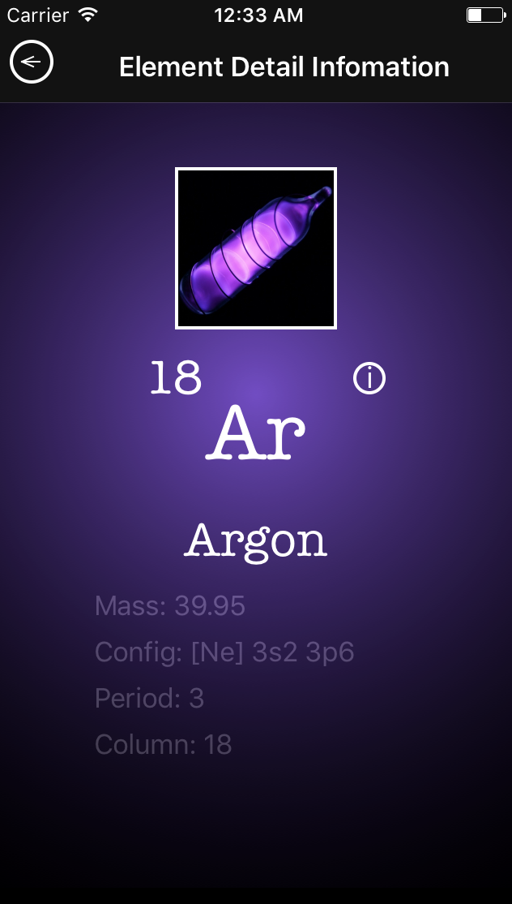

# PeriodicTable App
### Periodic Table -  приложение по мотивам таблицы Менделеева

Platform: iOS  
Development languages: Swift.  
Development Tools: Xcode  
Development Technologies:  MVVM  

### Compilation instructions:  
MacOS computer with Xcode v. 8.0 or higher  
Download repository.  
Open PeriodicTable.xcodeproj in /PeriodicTable folder  
Run project in iOS simulator device or connecter iOS device with iOS 10.0 or higher. 